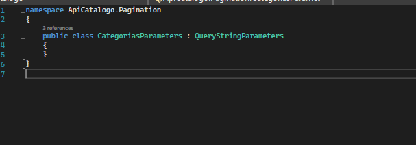
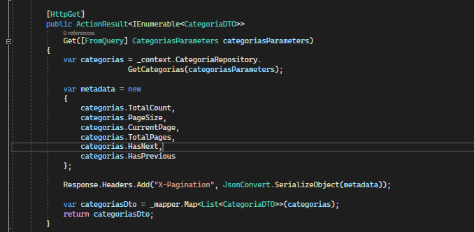

# Data Pagination

Data Pagination is a good practice pattern used in APIs, when we implement a method
Get is not advisable to return all the data present in the database. Imagine that the return is too big so you can crash your application layer.

To implement a data pagination just:

###  implement a class:

### Soon after, create another class with the name referring to your controller:

### In your interface of your IRepository you need to put the new method and then implement it:

### Just then modify your Get method:

