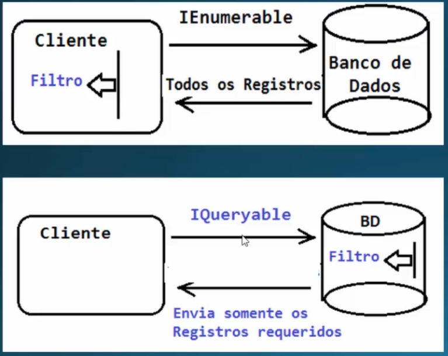

# IEnumerable vs IQueryable

When we define an IRepository interface we define methods and return types. If it is an IEnumerable, the queries in the repository filter the data, and when making the query it returns all the database records making a filter in memory, that is, it executes the query in memory with the objects that the repository returns.
When the approach is using IQueryable it does the filter on the database.
So the main difference between the two is where the filter is executed. So IQueryable lets you build a query that is sent to a query provider that sends it to the database.

IEnumerable -- Handle in-memory data collection.

IQueryable -- Lets you query the data collection and extend queries.

